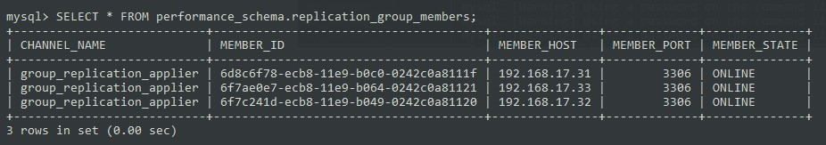
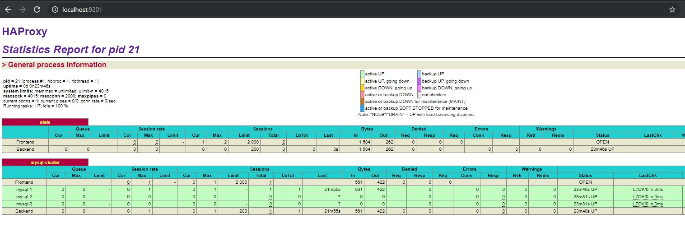
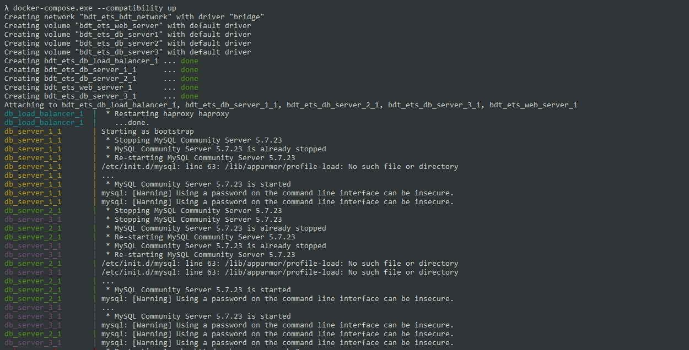

# Laporan ETS BDT 2019

## Tahapan Penyelesaian
1. Membuat container/instance setiap server. Server terdiri dari Web Server, DB Load Balancer, DB Server 1, DB Server 2, DB Server 3.
    - Untuk pembuatan container/instance server tersebut dapat menggunakan docker-compose agar proses installasi lebih cepat
    - DB Server (1 sampai 3) menggunakan image yang sama sehingga tidak perlu mendownload dependencies berulang-ulang

2. Untuk DB Server (1 sampai 3) dipasang MySQL Server beserta plugin group replication
    - Untuk mengecek apakah group replication berjalan atau tidak dapat menggunakan query berikut
        ```sql
        SELECT * FROM performance_schema.replication_group_members;
        ```
        

3. Untuk DB Load Balancer menggunakan HAProxy sebagai load balancer untuk ketiga DB Server
    - Untuk mengecek apakah service mysql berjalan atau tidak dapat dilakukan dengan cara melihat statistic page HAProxy di link `localhost:9201`
        
    - HaProxy tidak bisa digunakan untuk mengecek status group replication
    - Proxy DB Server dapat diakses melalui `localhost:3306` atau `127.0.0.1:3306`

4. Untuk Web Server menggunakan Apache dan PHP
    - Untuk koneksi database menggunakan konfigurasi berikut
        ```php
        DB_HOST=192.168.17.30       // IP HAProxy Server
        DB_PORT=3306                // Port HAProxy Server
        DB_DATABASE=reservasi
        DB_USERNAME=haproxy_root
        DB_PASSWORD=admin
        ```
    - Webserver dapat diakses melalui `localhost` atau `127.0.0.1`


## Cara Menjalankan Service
1. Lakukan build image untuk menginstall dependencies dan konfigurasi yang diperlukan
    ```bash
    docker-compose build
    ```

2. Untuk meng-create container dan menjalankannya dapat dilakukan dengan cara menjalankan perintah berikut
    ```bash
    # --compatibility digunakan agar dapat menggunakan versi file config docker-compose sebelumnya. Tujuannya untuk memberikan batasan/limit memory yang akan digunakan
    docker-compose --compatibility up

    # Untuk menjalankannya di background
    docker-compose --compatibility up -d
    ```
    

3. Untuk menghentikan salah satu server dapat dilakukan dengan cara
    ```bash
    # docker-compose stop nama_service
    docker-compose stop web_server
    ```

4. Untuk menghapus seluruh service dapat dilakukan dengan cara
    ```bash
    docker-compose down
    docker volume rm bdt_ets_web_server
    docker volume rm bdt_ets_db_server1
    docker volume rm bdt_ets_db_server2
    docker volume rm bdt_ets_db_server3
    ```
